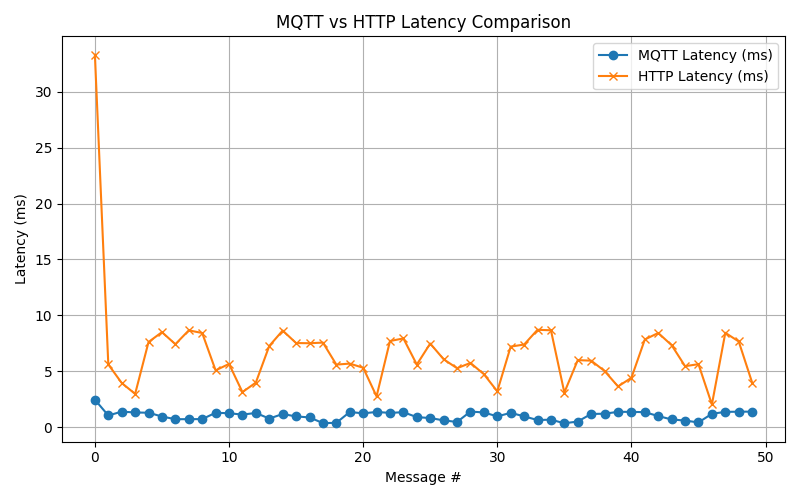

# MQTT vs HTTP Performance Comparison

## 📌 Overview
This project compares the performance of **MQTT** and **HTTP** for sending IoT sensor data.  
It measures **round-trip latency** for each protocol and visualizes the results in a graph.

---

## 📂 Directory Structure
```
MQTT-vs-HTTP-Performance/
├── app/
│   ├── cli.py              # CLI menu for running tests
│   ├── http_client.py      # Sends sensor data via HTTP
│   ├── http_server.py      # Flask server to receive HTTP data
│   ├── mqtt_client.py      # Reusable MQTT client factory
│   ├── mqtt_publisher.py   # Publishes sensor data via MQTT
│   └── performance_test.py # Runs performance tests and generates graphs
│
├── config/
│   └── settings.env        # Environment variables (broker URL, HTTP URL)
├── requirements.txt        # Dependencies
├── run.py                  # Entry point
└── README.md               # Documentation
```

---

## 🚀 Features
✅ Compare **MQTT vs HTTP latency**  
✅ Graph visualization with **Matplotlib**  
✅ CLI interface to run tests easily  
✅ Professional project structure, GitHub-ready  

---

## 📦 Requirements
- Python 3.8+
- Virtual environment (recommended)

Install dependencies:
```bash
pip install -r requirements.txt
```

---

## ⚙️ Environment Configuration
Edit `config/settings.env`:
```
BROKER_URL=localhost
BROKER_PORT=1883
TOPIC_PUB=sensors/performance
TOPIC_SUB=sensors/performance
HTTP_SERVER_URL=http://127.0.0.1:5050/data
```

---

## ▶️ How to Run

### **1️⃣ Terminal 1 – Start the HTTP Server**
```bash
cd MQTT-vs-HTTP-Performance
source venv/bin/activate
python app/http_server.py
```

Keep this terminal running.

---

### **2️⃣ Terminal 2 – Run the CLI**
```bash
cd MQTT-vs-HTTP-Performance
source venv/bin/activate
python run.py
```

You will see:
```
==== MQTT vs HTTP Performance ====
1) Test MQTT Publisher
2) Test HTTP Client
3) Run MQTT vs HTTP Comparison
4) Exit
Choose an option:
```

- **Option 1** → Sends MQTT messages  
- **Option 2** → Sends HTTP messages  
- **Option 3** → Runs both tests and shows a comparison graph  

---

## 📊 Example Output
After running Option 3:

```
=== Results ===
MQTT Avg Latency: 1.25 ms
HTTP Avg Latency: 6.80 ms
```

Graph output:  


---

## 📜 Learning Objectives
- Understand MQTT vs HTTP performance differences
- Learn how to measure latency in real-time
- Build a modular, GitHub-ready IoT project

---

## 📄 License
MIT License
